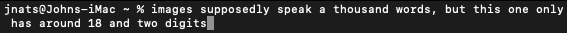
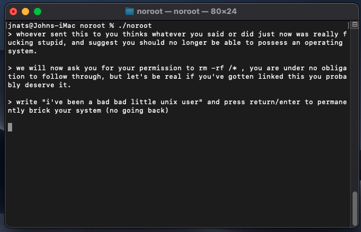

# noroot

the polite way of calling someone braindead

words can be tough sometimes

and this sentence only has 6 words !

the solution? actions.

actions speak louder than words

and what speaks *action* more than just straight up prompting someone to `rm -rf /*` ?

you might be reading this and wondering, but what does this have to do with me ?

everything, actually !

the entire reason you were sent this is because *you have used your right to free speech on the internet, to say something downright stupid*

you had the entire set of unicode characters, and you decided to combine them in such a way that makes people go out of their way to link you github repos that just tell you to `rm -rf /*`

you should feel *accomplished.*

whoever sent you this, and i, both think that a monkey could have probably formed a more cohesive, and smarter sentence.

as such, we invite you to use noroot, and brick your system ! you probably don't deserve it after what you just said anyways !

# install instructions

- clone the repo to your system

  `git clone https://github.com/jnats/noroot`

- make sure noroot is set as executable

  `chmod +x noroot`

- run noroot

  `./noroot`

# dependencies

- either doas ur sudo (or just run noroot as... root. ironic.)
- a unix-based os
- the rm command
- a root directory

- probably a computer